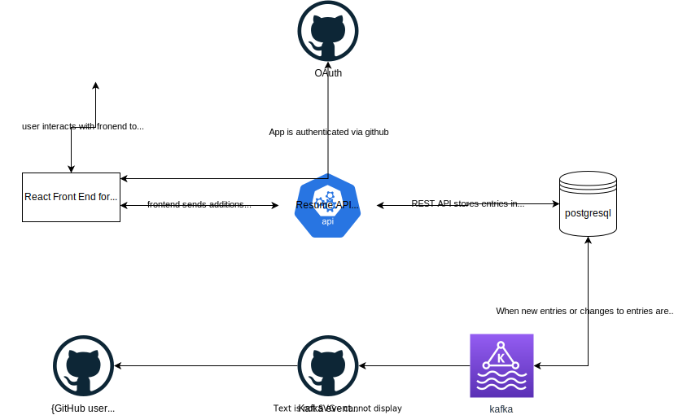

# how-to-over-engineer-your-resume

It's right there in the title. I'm sick of Word, Inkscape, Photoshop, etc. I just want to:
- update my resume in a basic UI
- have the entries stored in a database, 
- have those changes trigger an update of the git repo I have my resuem stored in 
- have my website uses my resume git repo as its data source to display my resume in both a webpage format and as a generated pdf

## The Plan

